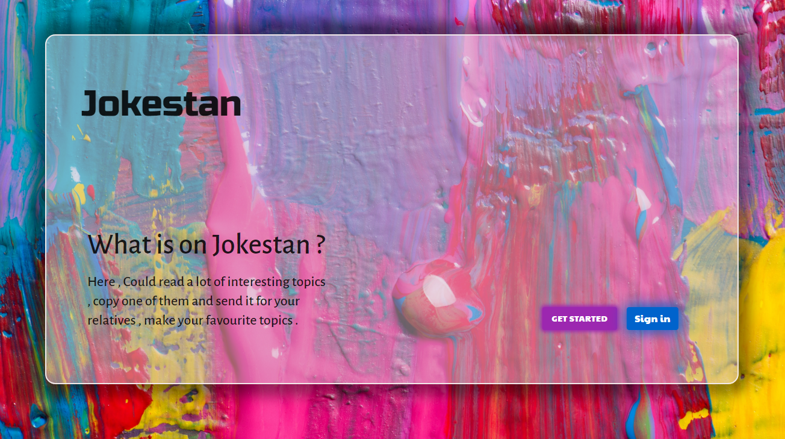

# Jokestan

<i>
    Created by Create-react-app    
</i>

<h3>
    Here , Could read a lot of interesting topics , copy one of them and send it for your relatives , make your favourite topics .
</h3>  

    <h4>included packages</h4>
    <ul>
        <li>Material-Ui</li>
        <li>Axios</li>
        <li>React-router-dom</li>
        <li>Json-server</li>
    </ul>

    <h4>Created by AdobeXd , Primary designed <a href="https://s29.picofile.com/d/8461629826/bb31826e-dd11-4ab6-ad49-0fa393eebdc6/Jokestan_1.xd">Download file</a></h4>

    <h3>Looking around Jokestan</h3>
    

